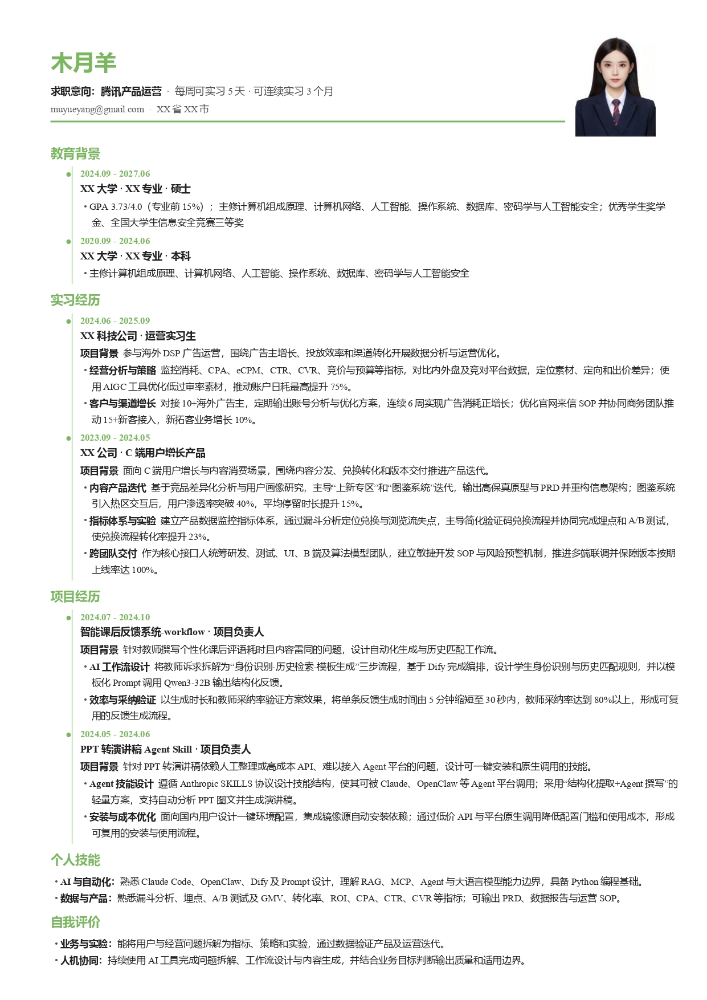

# OfferPilot｜从简历到面试的 AI 求职领航助手

> 面向求职全流程的 Agent Skill：从岗位调研、证据映射和定向简历，到逐条面试准备与复盘迭代。

## Skill 简介

OfferPilot 不只是“润色简历”。它会先检查输入是否完整，再理解目标岗位、提炼岗位能力、核对候选人证据，最后生成可解释、可面试、可持续迭代的求职材料。

适用于校招、实习、社招、转岗和跨专业求职，可根据 AI 产品、AI Agent、AI Coding、算法、后端、前端、产品、运营、数据分析等岗位调整内容重点。

## 能做什么

| 阶段 | 能力 |
| --- | --- |
| 输入体检 | 检查基本信息、教育经历、工作/实习经历、项目经历、个人技能、自我评价、求职意向和可到岗时间；发现缺项时分轮追问 |
| 岗位调研 | 调研公司、业务、岗位、竞品及招聘线索，从 JD 提取 3–5 项核心能力 |
| 证据映射 | 建立“岗位要求 → 真实经历 → 简历表达 → 面试证据”映射，标记证据缺口和风险 |
| 定向简历 | 按目标岗位调整排序与重点，用产品思维和内嵌 STAR 改写经历，不改变事实边界 |
| 文件生成 | 生成 DOCX，或使用 `classic / compact / modern / timeline` 四套模板离线生成 PDF |
| 质量自检 | 检查完整性、真实性、数字口径、角色边界、版式、分页、乱码和敏感信息 |
| 面试准备 | 生成逐条 bullet 深挖、项目讲法、自我介绍、追问、预警问题和诚实兜底表达 |
| 复盘迭代 | 根据用户补充事实、模拟回答和真实面试反馈，局部更新简历及面试材料 |

## 你需要输入

支持以下输入方式：

- 直接在对话中粘贴经历
- Markdown
- CSV 或 xlsx
- DOCX
- PDF

建议至少提供：

1. 当前简历或完整经历素材
2. 目标公司、岗位名称和 JD
3. 当前求职阶段：未投递、已投递、收到面试或面后复盘
4. 求职意向、地点、到岗时间或实习时长
5. 希望使用的模板：`classic / compact / modern / timeline`
6. 可选主题色：预设色或 `#RRGGBB`
7. 可选证件照、作品集、项目材料和数据口径说明


## 它为你输出

OfferPilot 根据任务选择最小充分交付，不默认堆叠过程文件。常见成品包括：

```text
output/
├── 姓名-公司-岗位-定向简历.docx
├── 姓名-公司-岗位-定向简历.pdf
├── 公司-岗位-岗位与证据分析.md
└── 面试准备/
    ├── 00-总览.md
    ├── 01-简历bullet逐条深挖.md
    ├── 02-表达与自我介绍.md
    ├── 03-{已确认或高置信轮次}.md
    └── 99-面后复盘.md
```

默认输出目录为：

```text
<offerpilot-skill 安装目录>/output/
```

## 模板效果

四套模板均支持可选头像、7 种预设颜色和自定义 `#RRGGBB`。未指定颜色时使用案例默认色；指定颜色时，大标题、模块标题、分隔线、时间轴、项目符号或强调底色会相应调整，版式结构保持不变。

| classic · 纯净单栏、黑白默认| compact · 三段式页眉、浅色分隔线 | modern · 左侧信息栏、右侧核心经历   |  timeline · 时间轴组织经历 |
| --- | --- | --- | --- |
| 适合ATS 投递、通用岗位、正式简历 | 适合校招、技术岗、内容较多且希望控制一页 | 适合互联网、AI 产品、产品经理、运营 | 适合经历密集、项目型候选人、强调发展脉络 |
|  |  |  |  |

## 安装

OfferPilot 基于 [Agent Skills](https://agentskills.io) 目录规范，可在 Claude Code、Codex、Cursor、OpenClaw 等支持 Skill 或可读取 `SKILL.md` 的兼容 runtime 中运行。

> [!IMPORTANT]
> 请安装完整的 `offerpilot-skill/` 文件夹，不要只复制 `SKILL.md`。`assets/`、`references/`、`scripts/`、`examples/` 和 `agents/` 都是运行所需内容。

### 方式一：让 AI Agent 安装（推荐）

将仓库地址和以下提示词交给支持 Skill 的 Agent：

```text
请从这个仓库安装 offerpilot-skill：
https://github.com/Rainie-not-rain/Offerpilot-skill.git

请安装完整的 offerpilot-skill 文件夹，不要只复制 SKILL.md。
请保留 assets、references、scripts、examples 和 agents 目录。
安装完成后，请检查 SKILL.md 可读取、脚本语法正常，并确认 output 文件夹可写。
```

### 方式二：手动安装

先克隆仓库：

```bash
git clone https://github.com/Rainie-not-rain/Offerpilot-skill.git
```

安装到 Codex：

```bash
mkdir -p ~/.codex/skills
cp -R ./offerpilot-skill ~/.codex/skills/offerpilot-skill
```

安装到 Claude Code：

```bash
mkdir -p ~/.claude/skills
cp -R ./offerpilot-skill ~/.claude/skills/offerpilot-skill
```

Cursor、OpenClaw 或其他 Agent Runtime：将完整的 `offerpilot-skill/` 复制到该 Runtime 配置的 Skills 目录；如果没有固定 Skills 目录，则让 Agent 读取 `offerpilot-skill/SKILL.md`，并允许其调用 `scripts/` 中的本地命令。

Windows PowerShell 示例：

```powershell
git clone https://github.com/Rainie-not-rain/Offerpilot-skill.git
Copy-Item -Recurse -Force .\offerpilot-skill "$env:USERPROFILE\.codex\skills\offerpilot-skill"
```

安装后建议检查：

- `SKILL.md`、`assets/`、`references/`、`scripts/`、`examples/` 和 `agents/` 均存在
- Runtime 能读取 Skill
- Python 运行环境可执行 `scripts/` 中的脚本
- DOCX/PDF 渲染所需的本地依赖可用
- `output/` 目录具有写入权限

### 方式三：作为参考资料

如果暂时不安装，可以把 `SKILL.md` 和 `references/` 提供给任意 AI，让它参考其中的岗位调研、简历改写、质量检查和面试准备方法。此模式不保证能够使用本地脚本、模板渲染和文件生成能力。

## 使用指令模板

### 生成定向简历

```text
请使用 $offerpilot-skill 为我生成定向简历。

【当前简历或经历素材】
[粘贴内容，或上传 DOCX/PDF/Markdown/CSV/xlsx]

【目标岗位】
公司：
岗位名称：
岗位 JD：
投递地点：

【求职信息】
求职意向：
可到岗时间/实习时长：
当前阶段：[未投递/已投递/已收到面试]

【模板选择】
模板：[classic/compact/modern/timeline]
主题色：[默认/blue/teal/wine/ink/purple/green/orange/#RRGGBB]
证件照：[已上传/暂无]
期望格式：[DOCX/PDF/DOCX+PDF]

请先检查信息是否完整；如有关键内容缺失，请先向我提问。
确认后进行岗位与证据分析，生成可投递的定向简历，并完成真实性与版式自检。
最终文件保存到 offerpilot-skill/output。
```

### 准备面试

```text
请使用 $offerpilot-skill，基于我的最终简历和目标 JD 准备面试。

公司与岗位：
最终简历：
已知面试轮次：
面试时间：

请逐条深挖简历 bullet，生成自我介绍、项目讲法、高频追问、风险预警问题和诚实兜底表达。
对不确定的轮次或业务信息请标明置信度，不要虚构。
```

### 根据回答继续迭代

```text
请使用 $offerpilot-skill 评估下面这段面试回答：
[粘贴回答]

请检查结构、证据、数字口径、角色边界和表达自然度。
先指出高风险点，再给出不改变事实的优化版本，并提出下一轮追问。
```

## Skill 目录

```text
offerpilot-skill/
├── SKILL.md                    # Agent 入口与主流程
├── README.md                   # GitHub 项目说明
├── agents/
│   └── openai.yaml             # Agent 展示与默认调用配置
├── assets/
│   ├── resume-base.css         # 本地基础样式
│   ├── resume.example.md       # Markdown 输入示例
│   ├── resume.example.csv      # CSV 输入示例
│   ├── readme/                 # README 模板预览图
│   └── templates/              # 四套离线 PDF 模板
├── references/
│   ├── research.md             # 岗位调研与来源可靠性
│   ├── resume.md               # 简历改写与 Word 规则
│   ├── interview.md            # 面试准备与复盘
│   ├── rendering.md            # 输入格式、模板和离线渲染
│   └── quality.md              # P0/P1/P2 质量闸门
├── scripts/
│   ├── init_case.py            # 初始化内部任务数据
│   ├── csv_to_md.py            # CSV/xlsx 转 Markdown
│   ├── quality_check.py        # 事实、结构与交付检查
│   ├── generate_resume.py      # 生成 DOCX
│   └── render_pdf.py           # 离线生成模板 PDF
├── examples/                   # 岗位、简历、模板和面试示例
└── output/                     # 默认最终交付目录
```

## 工作原理

```text
输入体检
   ↓
岗位调研与 JD 能力提炼
   ↓
岗位要求 ↔ 候选人证据映射
   ↓
事实约束下的定向简历改写
   ↓
质量闸门与版式渲染检查
   ↓
逐 bullet 面试准备
   ↓
根据补充事实与面试反馈迭代
```

## 能力边界

- 不编造教育、公司、项目、数据、成果、角色或面试轮次。
- 不替用户修改学校、公司、任职时间等背调硬信息。
- 不把“参与”“协助”自动升级为“主导”“负责”。
- 不承诺 ATS 通过率、面试通过率或 Offer 概率。
- 岗位动态、招聘流程和公司信息可能变化；需要联网核验，无法核验时会标注不确定性。
- 输入不足时只能先提问或输出待补充项，不能凭空完成事实性内容。
- 模板渲染依赖本地 Python、字体及 DOCX/PDF 工具链；缺少依赖时可能只能输出结构化文本或中间格式。
- 用户应自行确认个人信息、保密义务和对外投递权限；敏感信息默认不写入正文。
- OfferPilot 提供求职辅助与表达优化，不代替职业、法律或用人决策。

## License

本项目采用 [CC BY-NC-ND 4.0](LICENSE)(https://creativecommons.org/licenses/by-nc-nd/4.0/legalcode)。

允许个人学习、研究、教育及其他非商业用途。商业使用需要获得作者的单独授权。

由于该许可证限制商业用途，本项目属于“源码可用（source-available）”，不属于 OSI 定义下的开源软件。